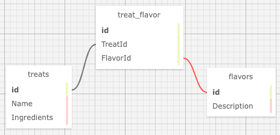

# Pierre's Sweet and Savory Treats

#### By E. Luckie ☀️

#### This webpage application acts as a marketing tool for a bakery owner. Users are able to view all of the currrent treats offered. They are also able to create a profile to be able to add, edit, and delete treats from the page.

## Technologies Used

* C#
* .NET 7.0
* EF Core 7.0
* Identity
* MySQL Workbench
* Razor HTML
* Markdown
* CSS
* Git

## Description
This webpage acts as an online bakery. When not logged in, the home page advises users to login or create an account to manage their own treats and flavors. Un-verified users are still able to view the list of all treats & all flavors. Once users have created an account, the home page displays the list of treats and flavors they have personally added. Users are able to add/edit/delete treats or flavors. They are also able to add a treat to a specified flavor profile, or add flavor profiles to a specified treat. From the account page, users are able to view/edit their account details or log out.

### Paths

**/** When not logged in, home page directs users to login or create an account. When logged in, displays list of users added treats and flavor profiles

**/Treats** Treats main page showing full list of current Treats and their respective flavors. If logged in, displays user's list of added treats along with a button to see all available treats

**/Flavors** Flavors main page showing full list of current flavors, If logged in, displays user's list of added flavors along with a button to see all available flavors

**/{Treats or Flavors}/Create** A form to add a new flavor or treat (depending on which link was clicked)

**/{Treats or Flavors}/Details/{id}** A page that displays the selected item's name (& ingredients, if a treat), and any associations between the flavors and treats. Includes links to add a new flavor/treat to this item or return back to the full list of items. Also includes buttons to edit, delete, or remove associations from the item
* The _edit_ button pops up a window to update the selected item. Canceling dismisses the window, & updating refreshes the page to display the new updates
* The _delete_ button pops up a window to confirm deletion of the selected item. If deleted, the user is re-routed back to respective main page. Canceling dismisses the window

**/Flavors/AddTreat/{id}** A page that displays the selected flavor's name and a drop down list of current treats. The user is able to select one treat from the list at a time to _Add_ which will associate the selected treat with the flavor and re-route to the selected flavor's details page, showing the updated list of associated treats

**/Treats/AddFlavor/{id}** A page that displays the selected treat's name and a form to select checkboxes of the current flavors. The user is able to select multiple flavors from the list and click _Add_ which will associate the selected flavors with the treat and re-route to the treat's details page, showing the updated list of flavors

**/Account** When not logged in, simply displays links to either create an account or login. When logged in, welcomes the user by name and displays their username & email. There is also buttons to edit or log out
* The _edit_ button pops up a window to edit your account nickname or username. Canceling dismisses the window, & updating refreshes the page to display the new updates
* The _log out_ button logs the user out of their account and redirects them to the main home page


## Setup/Installation Requirements

1. Clone this repository
2. Open your terminal (e.g., Terminal or GitBash) and navigate to this project's production directory called _**Treats**_.
3. In the command line, run the command ``dotnet restore`` to restore the necessary packages for the application to run
4. Within the production level of this directory, called _**Treats**_, create a new file called ``appsettings.json``
5. Input the following code into your ``appsettings.json`` file

```
{
  "ConnectionStrings": {
    "DefaultConnection": "Server=localhost;Port=3306;database=[YOUR-DB-NAME];uid=[YOUR-USER-HERE];pwd=[YOUR-PASSWORD-HERE];"
  }
}
```
* Replace _[ YOUR-DB-NAME ]_ with the name you would like for the database that you will be utilizing via MySQL Workbench
* Replace _[ YOUR-USER-HERE ]_ with your username for MySQL Workbench
* Replace _[ YOUR-PASSWORD-HERE ]_ with your password for MySQL Workbench
* Make sure you save the changes you've made to the file
* If you are planning on pushing your work back to GitHub to a new repository, _make sure to commit your .gitignore file first so that your sensitive information is kept private_

### Viewing the Active Project
6. In your computer's terminal, navigate to the production level of this directory called _**Treats**_
7. In the command line, run the command ``dotnet ef database update``
* This will create a new database for the project in MySQL Workbench named as you specified in the ``appsettings.json`` file.
* You may choose to verify that the new database and related tables were created accurated in MySQL Workbench by clicking the small refresh button in the top right corner of the _Schemas_ tab. Your new database name should appear on the list and you should be able to click on it to view/alter the relevant tables
8. In the command line, run the command ``dotnet watch run`` to compile and execute the webpage in Development mode
* Optionally, you can run the command ``dotnet build`` to compile the program without running it

_**Keep in mind, the project is currently set in development mode so the password requirements are off. If deploying, you will need to un-comment out the Default Password Requirements in ``Program.cs`` as well as the regular expression in ``Treats/ViewModels/RegisterViewModel.cs``**_

### Schemas


## Known Bugs

* If leaving a form empty on update, throws an exception page rather than displaying error message
* If leaving a spot empty on edit form for user, does not throw an error

## Stretch Plans

* Have separate roles for admins & logged-in users. Only admins should be able to CUD
* Add an order form that only logged-in users can access. Logged-in users should be able to CRUD their own orders

## License

MIT License

Copyright (c) 2023 Luckie